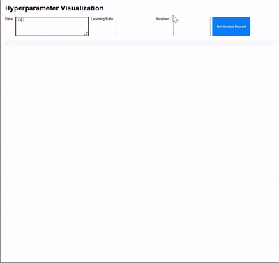

# Hyperparameter Visualization

This project provides a Visualization tool to demonstrate the process of **Gradient Descent**, a fundamental optimization algorithm in machine learning. The application allows users to experiment with hyperparameters like learning rate and iterations, while visually observing the optimization process.

## Features
- **Interactive Form**: Input custom data points, learning rate, and the number of iterations.
- **Gradient Descent Visualization**:
  - Displays the trajectory of parameters `m` (slope) and `c` (intercept) during optimization.
  - Plots the path taken by Gradient Descent to reach the optimal values.
- **Dynamic Output**: Shows the final linear equation after optimization.

## Requirements
- Python 3.7+
- Flask
- Flask-CORS
- Plotly.js (loaded via CDN)

## Installation
1. Clone the repository:
   ```bash
   git clone https://github.com/RaffiArdhiN/Hyperparameter_Visualization.git
   cd Hyperparameter_Visualization
   ```

2. Create a virtual environment (optional but recommended):
   ```bash
   python -m venv venv
   source venv/bin/activate # On Windows: venv\Scripts\activate
   ```

3. Install dependencies:
   ```bash
   pip install -r requirements.txt
   ```

4. Run the Flask application:
   ```bash
   python app.py
   ```

5. Open the application in your browser:
   ```
   http://127.0.0.1:5000
   ```

## Project Structure
```
Hyperparameter_Visualization/
├── app.py                # Main Flask application
├── gradient_descent.py   # Gradient Descent logic
├── templates/
│   └── index.html        # Frontend HTML
├── static/
│   ├── css/
│   │   └── style.css     # Custom CSS styling
│   └── js/
│       └── main.js       # Frontend JavaScript logic
└── .gitignore            # Git ignore file
```

## Usage
1. **Input Data**: Enter data points in the format `[[x1, y1], [x2, y2], ...]`.
2. **Set Hyperparameters**:
   - **Learning Rate**: Controls the step size during optimization.
   - **Iterations**: Number of steps for the Gradient Descent algorithm.
3. **Run Gradient Descent**: Click "Run Gradient Descent" to execute the optimization process.



4. **View Results**:
   - Observe the optimized line equation (`y = mx + c`).
   - Analyze the trajectory of parameters `m` and `c` on the visualization graph.

## Example
### Input
- Data: `[[1, 2], [2, 3], [3, 4]]`
- Learning Rate: `0.01`
- Iterations: `100`

### Output
- **Final Line**: `y = 1.1001x + 0.7724`
- **Graph**: Displays the path of Gradient Descent towards the optimal solution.

## Contributing
Contributions are welcome! Please fork the repository and submit a pull request for any enhancements or bug fixes.

## License
This project is licensed under the MIT License. See the [LICENSE](LICENSE) file for details.
